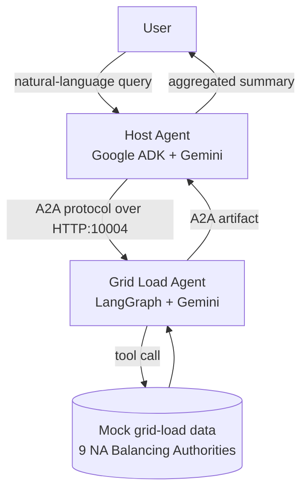
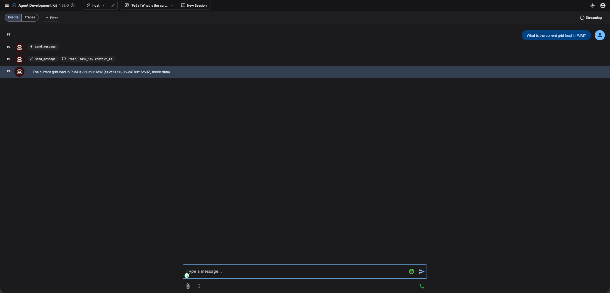

# hvac-cyber-id

> **Phase 1 of the HVAC-CyberEnergy-CoDesign Framework: a multi-agent A2A orchestration layer for grid-load telemetry across North American Balancing Authorities.**

A Host Agent (Google ADK) orchestrates a worker LangGraph agent that returns mock grid-load values for US RTO/ISOs (PJM, MISO, ERCOT, CAISO, SPP, NYISO, ISO-NE) and Canadian ISOs (AESO, IESO). Pattern is the artifact; the regulated-industry framing is grid load / critical infrastructure / HVAC-CyberEnergy.

This is the orchestration spine of a progressively deepening portfolio piece. **Phase 2** (planned) re-platforms the underlying ML intrusion-detection pipeline (RT-IoT2022, FastAPI, AWS) against the same critical-infrastructure framing. **Phase 3** (planned) wires a RAG copilot over CISA OT advisories and a LangGraph incident-response loop on top of the orchestration shown here.

## Built on published research

> **Muniru & Sun (Feb 2026).** *AI based enhanced Twofish encryption: empowering a secure voting mechanism with SnS and extended cyclic groups.* Cluster Computing, Springer. [DOI: 10.1007/s10586-025-05769-0](https://doi.org/10.1007/s10586-025-05769-0)

The Springer paper introduces the cryptographic primitive layer for the HVAC-CyberEnergy-CoDesign Framework. This repo is the orchestration layer that operationalizes that research into a production-shaped agentic system.

## Why this matters

- US buildings consume **~40%** of national energy; HVAC is the largest commercial share.
- BAS (Building Automation System) attacks rose **9× from 2023 to 2024** — IoT/OT telemetry is now a top-tier critical-infrastructure target.
- The work aligns with the National AI Initiative Act (2020) and CISA's OT/IoT cybersecurity priorities.
- Grid-load telemetry is the first regulated-industry signal a deployable HVAC-CyberEnergy stack has to reason about; it's also the easiest to demonstrate as a multi-agent orchestration pattern.

## Architecture



**Key signals demonstrated:**

- A2A protocol literacy (agent-to-agent messaging, AgentCard discovery, task lifecycle).
- Framework heterogeneity: Google ADK orchestrates a LangGraph worker (not the same framework, by design).
- Regulated-industry framing: grid load / critical infrastructure telemetry, not a toy domain.
- Honest extension: pivoted from a public Google A2A codelab sample, scoped to original domain.

## Supported Balancing Authorities

US RTO/ISOs: **PJM, MISO, ERCOT, CAISO, SPP, NYISO, ISO-NE**
Canadian ISOs: **AESO** (Alberta), **IESO** (Ontario)

## Stack

- Python 3.13, [uv](https://docs.astral.sh/uv/) for env + deps.
- [Google ADK](https://github.com/google/adk-python) for the Host Agent.
- [LangGraph](https://github.com/langchain-ai/langgraph) for the worker.
- [`a2a-sdk`](https://github.com/google/a2a-python) `>=0.2.5,<0.3.0` for agent-to-agent transport. (1.0+ refactored to a new `Client`/`ClientFactory` API; pinned here for stability.)
- [`google-generativeai`](https://ai.google.dev/) Gemini 2.5 Flash for both agents (swappable in `grid_load_agent/app/agent.py` and `host_agent/host/agent.py`).

## Run locally

You need a Gemini API key. Get one at https://aistudio.google.com/app/apikey.

```bash
git clone https://github.com/nashtgc/hvac-cyber-id.git
cd hvac-cyber-id
cp .env.example .env       # then edit and set GOOGLE_API_KEY
```

Terminal 1 (worker, port 10004):

```bash
cd grid_load_agent
uv venv && source .venv/bin/activate && uv sync
cp ../.env .
uv run python -m app
```

Terminal 2 (host, ADK web on port 8000):

```bash
cd host_agent
uv venv && source .venv/bin/activate && uv sync
cp ../.env .
uv run adk web
```

Open http://localhost:8000, pick `Host_Agent`, ask:

> What is the current grid load in PJM?

You should see the Host Agent delegate via A2A, the worker return a mock MW value, and the Host return a user-facing summary.

## Demo



The trace shows the full orchestration in one frame: the user prompt (#1), the Host Agent's `send_message` tool call to the worker (#2), the tool response with the worker's grid-load artifact + ADK state updates for `task_id` / `context_id` (#3), and the Host Agent's final user-facing summary (#4) — *"The current grid load in PJM is 85059.3 MW (... mock data)"*.

## What v1 is NOT

- Not connected to a real grid feed. Mock MW values, ranges grounded in public EIA Open Data / AESO / IESO historical averages.
- Not a production deployment. Local-only. No auth, no rate limiting, no observability.
- Not an ML model. v1 is the orchestration pattern, not the anomaly detection — that's Phase 2.

## Roadmap

### Phase 2 — Production ML intrusion-detection pipeline
- Wire real **EIA Open Data API** (US BAs) and **AESO/IESO public feeds** (Canadian ISOs).
- ML detection layer on **RT-IoT2022** (123,117 instances, 83 features); seven-classifier benchmark with minority-class precision/recall.
- Containerized FastAPI inference service.
- AWS SageMaker (or ECS) deployment.
- Streamlit operations dashboard.

### Phase 3 — Agentic security copilot
- `hvac-threat-copilot`: RAG over CISA OT advisories, queryable through this repo's orchestration spine.
- `hvac-ir-agent`: LangGraph incident-response loop with playbook routing.
- Add a second worker (Energy Price Agent or HVAC Demand Agent) to the Host's fan-out.

## Credits

- **Pattern source:** Google A2A samples and the [A2A Codelab](https://codelabs.developers.google.com/intro-a2a-purchasing-concierge#1).
- **Learning source:** Analytics Vidhya, "Building End-to-End MCP for Agentic AI" (April 2026 cohort).
- **Research anchor:** Muniru & Sun (Feb 2026), Springer Cluster Computing. [DOI: 10.1007/s10586-025-05769-0](https://doi.org/10.1007/s10586-025-05769-0)
- **Domain pivot, README, mock data design, multi-agent orchestration prose:** original work for this repo.

## License

MIT. See [LICENSE](LICENSE).
