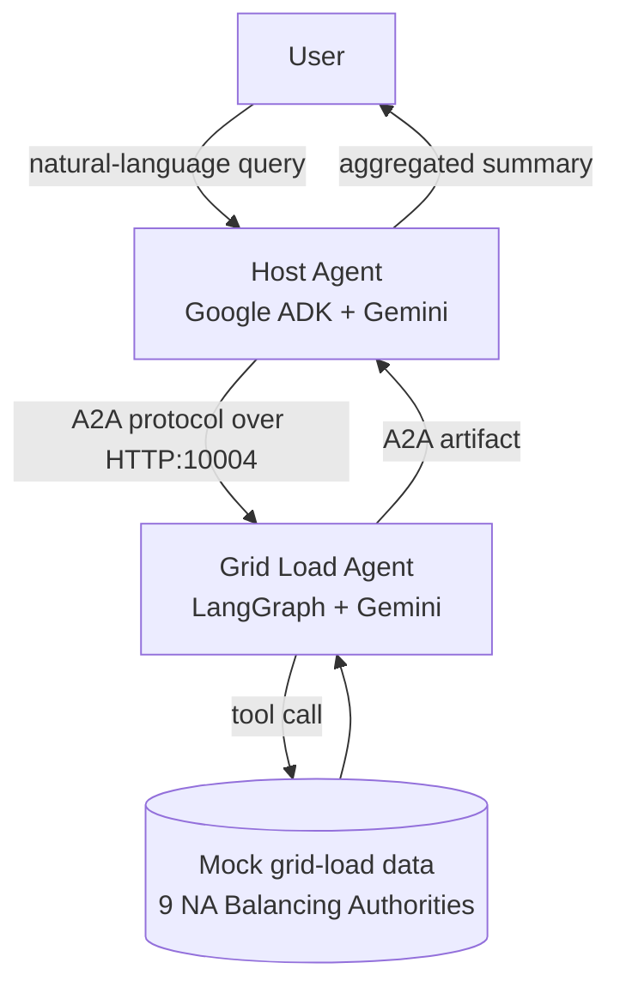
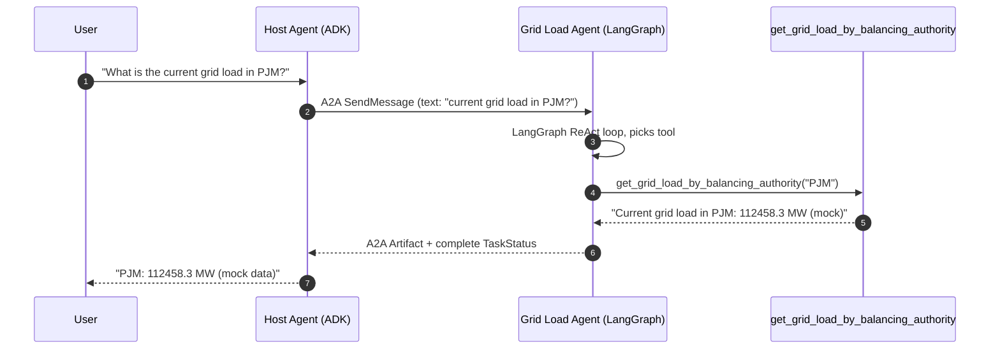

# Architecture

## Component diagram

## Sequence (single-BA query)

## Lifecycle and protocol notes

- AgentCard discovery: at startup the Host fetches the worker's AgentCard from `/.well-known/agent.json`.
- Task lifecycle: every user query becomes a Task. The worker emits TaskStatusUpdate (`working`, `input_required`, `completed`) and TaskArtifactUpdate events. The Host aggregates artifacts and surfaces them to the user.
- Session context: the Host carries `session_id` across multi-turn conversations so memory persists per user.
